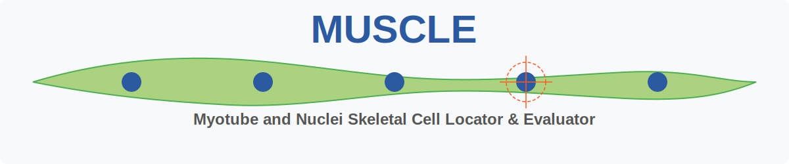

<div align="center">
  
</div>

# MUSCLE - Myotube and Nuclei Skeletal Cell Locator &amp; Evaluator

## Overview

MUSCLE is a comprehensive Python-based image analysis tool designed for automated detection and quantification of myotubes and nuclei in microscopy images. It provides researchers with accurate measurements of muscle cell differentiation, including the Nuclear Fusion Index (NFI), a critical metric for assessing myoblast fusion efficiency.

## Key Features

- **Automated Nuclei Detection**: Uses Cellpose deep learning model for accurate nuclei segmentation
- **Intelligent Myotube Segmentation**: Custom algorithm with intensity-based thresholding and morphological refinement
- **Nuclear Fusion Index Calculation**: Automated calculation of NFI and other differentiation metrics
- **Batch Processing**: Process entire datasets with progress tracking
- **Interactive GUI**: User-friendly Jupyter widget interface for parameter adjustment
- **Flexible Output**: Export results as CSV/Excel, save segmentation masks, and generate visual reports
- **GPU Acceleration**: Optional CUDA support for faster processing

## 🚀 Available Versions

### 📓 Interactive Notebook Version
**Repository**: [MUSCLE](https://github.com/krendlV/MUSCLE)

For developers and researchers who want full code access and customization.

- Lightweight download
- Full code visibility and editability
- **GPU acceleration support**
- Manual environment setup required

### 🐳 Dockerized Application Version
**Repository**: [MUSCLE-APP](https://github.com/krendlV/MUSCLE/tree/app)

For end-users who want a ready-to-run application with enhanced UI.

- Complete containerized solution (~500MB+)
- Polished user interface (Voila-based)
- One-click deployment with Docker
- **CPU-only processing** (GPU support removed for consistency)

## 🧪 Open Beta Phase

This project is in open beta. I am seeking feedback to improve both versions.

**How to contribute:**
- **🐛 Issues**: Report bugs in the relevant repository
- **🔧 Pull Requests**: Contribute code improvements  
- **💡 Feedback**: Share your experience and suggestions

Your input helps make this project better for everyone!

## Installation

### Prerequisites
- Docker Desktop installed and running
- Archive extraction software (WinRAR, 7-Zip, etc.)

### Setup
1. **Download**: Get [muscle-docker-v1.0.rar](https://github.com/krendlV/MUSCLE/releases/download/v1.0.0/muscle-docker-v1.0.rar) from the releases.
2. **Extract**: Unpack the archive to your desired location (~2GB extracted)
3. **That's it!** Everything needed is included in the archive

## Usage

### Quick Start
1. **Start Docker Desktop** (make sure it's running)
2. **Run the startup script:**
   - **Windows**: Double-click `start.bat`
   - **Linux/Mac**: Run `./start.sh` in terminal

### First Run
- The Docker image will be built automatically from the included `.tar` file
- This may take a few minutes on first launch
- The application will start automatically in a new browser window
- An `output` directory will be created in your project folder

### Processing Images
1. **Add your images**: Place microscopy images in the `input` directory (or create a symlink to your image folder)
2. **Run analysis**: The app launches automatically in your browser
   - If the browser doesn't open automatically, navigate to the displayed URL
   - Sometimes you may need to refresh the browser tab
3. **Process new batches**: 
   - Add new images to the `input` directory
   - Simply refresh the browser tab to process the new batch
   - Each run creates a timestamped folder in the `output` directory

### Output
- Results are automatically saved in timestamped folders within the `output` directory
- Each analysis run creates a new folder with format: `YYYY-MM-DD_HH-MM-SS`
- No manual file management required

### Troubleshooting
- **Browser doesn't open**: Check the terminal output for the application URL (usually `http://localhost:8877`)
- **Application not loading**: Wait a moment and refresh the browser tab
- **Docker issues**: Ensure Docker Desktop is running and has sufficient resources allocated

## Parameters

### Detection Parameters

- **Min Myotube Size**: Minimum area (pixels) for valid myotubes (default: 200)
- **Max Coverage %**: Maximum allowed myotube coverage percentage (default: 40%)
- **Min/Max Fiber Intensity**: Intensity thresholds for myotube detection (default: 25-200)
- **Initial/Max Nuclei Threshold**: Thresholds for nuclei detection optimization (default: 50-120)

### Processing Options

- **Use GPU**: Enable CUDA acceleration if available
- **Use Manual Diameter**: Override automatic nuclei diameter estimation
- **Use Cropping**: Speed up diameter estimation by analyzing image center

### Output Options

- **Save Plots**: Generate and save visualization plots
- **Save Masks**: Export segmentation masks as TIFF files
- **Save Results**: Export quantitative data to CSV/Excel

## Output Files

### Visualization Plots
- Multi-panel figures showing:
  - Original image
  - Colored myotube masks
  - Myotube boundary overlays
  - Nuclei classification (green: inside myotubes, red: outside)

### Segmentation Masks
- `*_myotubes_masks.tif`: 16-bit labeled myotube regions
- `*_nuclei_masks.tif`: 16-bit labeled nuclei regions

### Quantitative Results
- Excel/CSV files containing:
  - Per-myotube metrics (length, diameter, area, nuclei count)
  - Per-image statistics (NFI, coverage, total nuclei)
  - Summary statistics across dataset

## Metrics Calculated

- **Nuclear Fusion Index (NFI)**: Percentage of nuclei within myotubes
- **Myotube Morphology**: Length, diameter, and surface area
- **Nuclei per Myotube**: Count of nuclei within each myotube
- **Coverage Percentage**: Fraction of image area covered by myotubes

## Supported Image Formats

- TIFF (.tif, .tiff)
- JPEG (.jpg, .jpeg)
- PNG (.png)

## Requirements

- numpy>=1.21.0
- opencv-python>=4.5.0
- scikit-image>=0.19.0
- matplotlib>=3.5.0
- cellpose>=2.0.0,<4.0
- torch>=1.10.0
- tifffile>=2021.11.0
- pandas>=1.3.0
- openpyxl>=3.0.0
- ipywidgets>=8.0.0
- jupyter>=1.0.0

## Troubleshooting

### Common Issues

1. **CUDA not available**: Ensure PyTorch is installed with CUDA support
2. **Memory errors**: Reduce batch size or use CPU mode
3. **Poor segmentation**: Adjust intensity thresholds and diameter estimation

### Tips for Best Results

- Use consistent imaging conditions across your dataset
- Ensure good contrast between myotubes and background
- Verify nuclei staining quality (DAPI/Hoechst in blue channel)
- Start with default parameters and adjust based on initial results

## Citation

If you use MUSCLE in your research, please cite:

```bibtex
@software{muscle2025,
  title = {MUSCLE: Myotube and Nuclei Skeletal Cell Locator & Evaluator},
  author = {Valentin Krendl},
  year = {2025},
  url = {https://github.com/krendlV/MUSCLE}
}
```

## License

This project is licensed under the GNU General Public License v3.0 - see the LICENSE file for details.


## Contributing

Contributions are welcome! Please feel free to submit a Pull Request.

## Acknowledgments

- The three test images used in this project were provided by Lisa Stadler from her Master's thesis "Effects of cellular senescence on myogenesis in vitro" (2024), conducted at the University of Applied Sciences Technikum Wien. These images are used for testing purposes only with permission.
- Cellpose team for the excellent nuclei segmentation model
- Portions of the myotube detection algorithm incorporate code from [MyoFinDer](https://github.com/TissueEngineeringLab/MyoFInDer) by the Tissue Engineering Lab, which improved the performance of the myotube detection methods.

## Contact

For questions or support, please open an issue on GitHub or contact [valentin.krendl@gmail.com]
